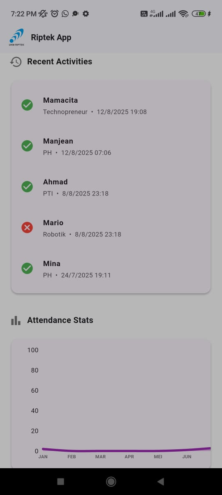

# Riptek App


Aplikasi rekap presensi siswa yang dibangun menggunakan Flutter dan Firebase. Aplikasi ini menyediakan dasbor komprehensif untuk memonitor, memvisualisasikan, dan mengekspor data kehadiran yang tersimpan di Cloud Firestore.

---

## 📸 Cuplikan Layar




_(Catatan: Pastikan Anda menempatkan file cuplikan layar bernama `screenshot.png` di dalam folder `assets`)_

---

## ✨ Fitur

- **📈 Dasbor Statistik**: Menampilkan ringkasan data kehadiran dalam bentuk visual yang mudah dipahami.
- **🕒 Aktivitas Terbaru**: Melihat 5 log presensi terakhir secara _real-time_.
- **📊 Grafik Bulanan**: Visualisasi jumlah total aktivitas per bulan dalam bentuk _line chart_ yang dapat digulir (scrollable).
- **📋 Daftar Aktivitas Lengkap**: Tabel yang menampilkan seluruh data presensi dengan fitur-fitur berikut:
  - **Filter**: Saring data berdasarkan "Minggu Ini", "Bulan Ini", atau "Tahun Ini".
  - **Paginasi**: Data dibagi menjadi beberapa halaman (10 data per halaman) untuk navigasi yang mudah.
- **📄 Ekspor Data**: Ekspor seluruh data presensi dari Firestore ke dalam format:
  - **PDF**: Untuk laporan formal.
  - **XLSX (Excel)**: Untuk analisis data lebih lanjut.

---

## 🚀 Memulai Proyek

Untuk menjalankan proyek ini di lingkungan lokal Anda, ikuti langkah-langkah berikut.

### Prasyarat

- Pastikan Anda sudah menginstal [Flutter SDK](https://flutter.dev/docs/get-started/install) di komputer Anda.
- Sebuah editor kode seperti [VS Code](https://code.visualstudio.com/) atau [Android Studio](https://developer.android.com/studio).

### Instalasi

1.  **Clone repositori ini:**

    ```bash
    git clone [https://github.com/your-username/riptek_app.git](https://github.com/your-username/riptek_app.git)
    cd riptek_app
    ```

2.  **Instal dependensi:**
    Jalankan perintah berikut di terminal untuk mengunduh semua package yang dibutuhkan.

    ```bash
    flutter pub get
    ```

3.  **Konfigurasi Firebase:**
    Proyek ini menggunakan Firebase sebagai backend. Anda **harus** mengkonfigurasi proyek Firebase Anda sendiri.

    - Buat proyek baru di [Firebase Console](https://console.firebase.google.com/).
    - Tambahkan aplikasi Android/iOS ke proyek Firebase Anda.
    - Unduh file konfigurasi `google-services.json` (untuk Android) dan letakkan di dalam direktori `android/app/`.
    - Di **Cloud Firestore**, buat _collection_ dengan nama `presensi`.
    - Tambahkan beberapa dokumen ke dalam _collection_ `presensi` dengan struktur field sebagai berikut:
      - `nama` (String)
      - `divisi` (String)
      - `status` (String, contoh: "Hadir" atau "Tidak Hadir")
      - `waktu` (Timestamp)

4.  **Jalankan aplikasi:**
    ```bash
    flutter run
    ```

---

## 📦 Dependensi Utama

Proyek ini menggunakan beberapa _package_ penting dari [pub.dev](https://pub.dev/):

- `cloud_firestore`: Untuk interaksi dengan database Firestore.
- `fl_chart`: Untuk membuat grafik statistik yang interaktif.
- `data_table_2`: Untuk membuat tabel data dengan paginasi dan fitur lanjutan.
- `intl`: Untuk memformat tanggal dan waktu.
- `pdf` & `excel`: Untuk membuat file laporan PDF dan XLSX.
- `path_provider`: Untuk mendapatkan path direktori penyimpanan file.
- `open_filex`: Untuk membuka file yang telah diekspor.

---

Dibuat dengan ❤️ menggunakan Flutter.
